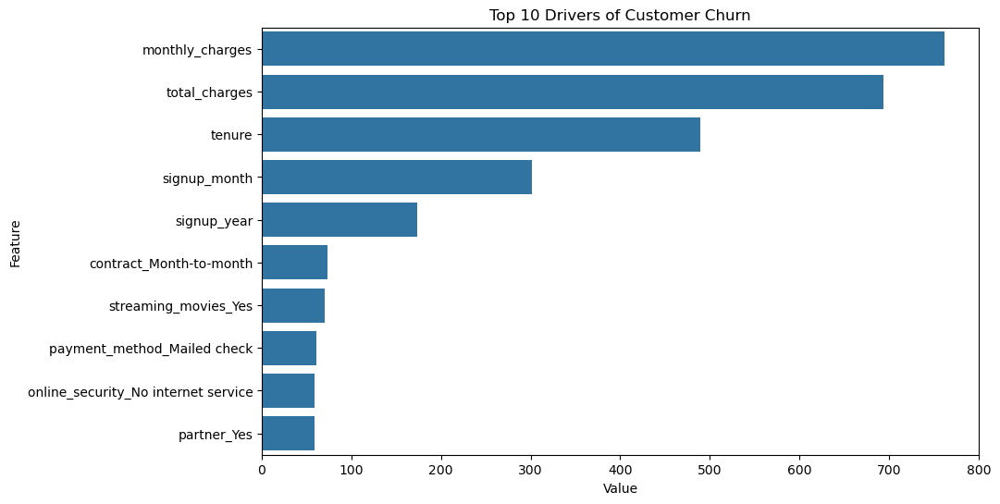

# customer-churn-analysis

Title: Customer Churn Analysis & Predictive Modeling

Objective: To identify and mitigate customer attrition using machine learning.

Key Insight: Our LightGBM model successfully identified key churn drivers, allowing us to prioritize retention for high-risk customers.

### Key Findings: Top 10 Drivers of Customer Churn

